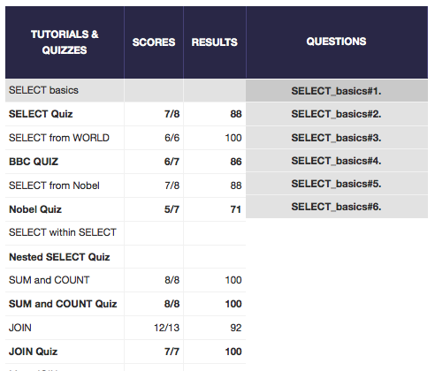

## U3.W7: SQLZoo

####I worked on this challenge by myself.

### My Quiz Results:
<!-- Include the link to your image (saved in the imgs folder) to display it inline. -->

### Reflection

This challenge took quite a bit of time, but I found the zetcode SQL tutorial very helpful.It took me a little while to grasp when to use some of the commands, such as GROUP BY vs. HAVING.