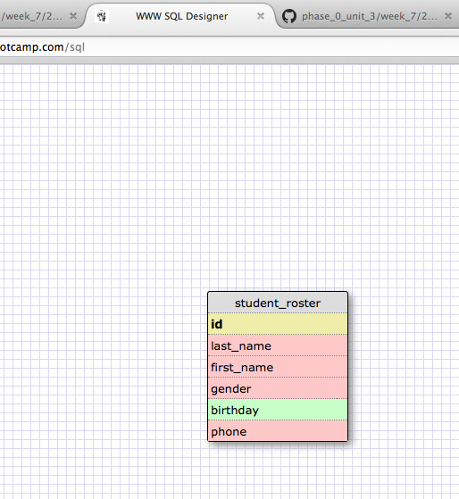
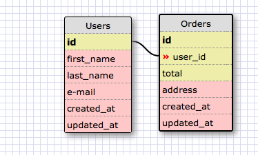
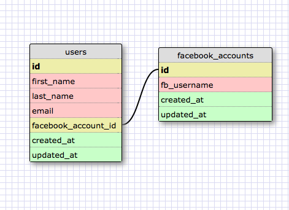
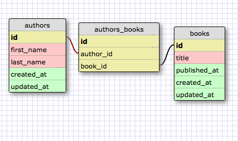
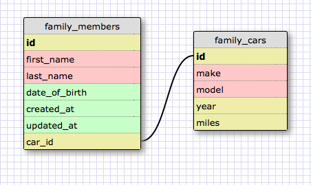
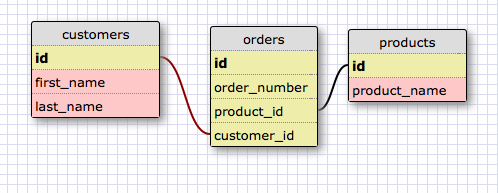

# U3.W7: Designing Schemas

#### I worked on this challenge by myself.

## Release 0: Student Roster Schema

<!-- display your image inline here -->

## Release 1: One to Many Schema
<!-- display your image inline here -->

## Release 2: One to One Schema
<!-- display your image inline here -->

## Release 3: Many to Many Schema
<!-- display your image inline here -->

## Release 4: Design your own Schema
Description of what you're modeling: 

My one to one schema represents the members of a family and the cars that they own. Each car is only associated with one particular family members, but a family member may be associated with multiple cars.

My many to many schema represents customers, their various orders, and products for sale. Each order has a customer and a product associated with it.

<!-- display your one-to-one image inline here -->
<!-- display your many-to-many image inline here -->

## Release 5: Reflection

My experience working through this exercise and with SQL so far has been quite interesting.I used to work quite regularly with data in large Excel spreadsheets, and it is interesting to see the parallels between various SQL commands and Excel formulas that I've used in the past.
