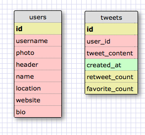

# U3.W7: Modeling a Real-World Database (SOLO CHALLENGE)

## Release 0: Users Fields
username
photo
header
name
location
website
bio

## Release 1: Tweet Fields
name
username
timestamp
tweet content
retweet count
favorite count

## Release 2: Explain the relationship
The relationship between `users` and `tweets` is: 
One to many because each user can have many tweets, but each tweet can only be composed by one user.

## Release 3: Schema Design

## Release 4: SQL Statement
<code>SELECT tweet_content FROM tweets WHERE user_id = 1</code>
<code>SELECT tweet_content FROM tweets WHERE user_id = 1 AND created_at > 2014-05-14</code>
<code>SELECT tweet_content FROM users JOIN tweets on (users.id = tweets.user_id) WHERE handle = "@KOINES"</code>
<code>SELECT username FROM users JOINT tweets ON (users.id = tweets.user_id) WHERE tweets.id = 1</code>

## Release 5: Reflection

<!-- Be sure to add your reflection here!!! -->
I've found a one to many relationship to be one of the easier types of relationships to understand. 